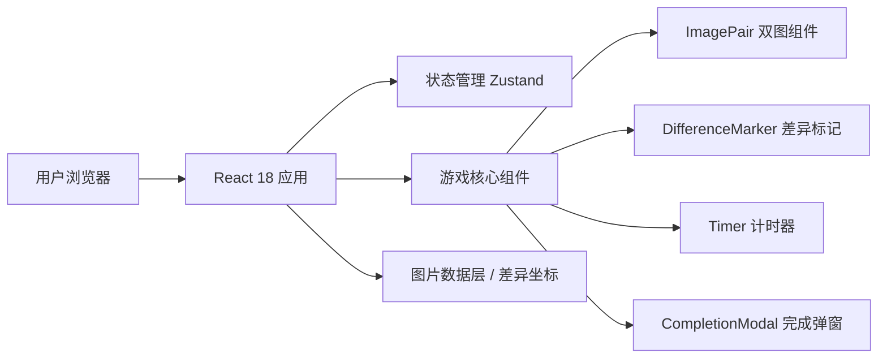

## 1. 架构设计

纯前端单页应用，无需后端服务。所有图片资源和差异点坐标数据均内置在前端代码中。



## 2. 技术描述

- **前端**：React@18 + TypeScript + Tailwind CSS@3 + Vite
- **初始化工具**：vite-init（react-ts 模板）
- **状态管理**：Zustand（轻量状态管理，管理游戏状态、计时、找到的差异）
- **后端**：无（纯前端应用）
- **数据库**：无（Mock 数据内置在 TS 模块中）

## 3. 路由定义

| 路由 | 用途 |
|-------|---------|
| / | 游戏主页（唯一页面，所有功能在此） |

## 4. 数据模型

### 4.1 图片组数据结构

```typescript
interface Difference {
  id: number;
  x: number;      // 图片宽度百分比 0-100
  y: number;      // 图片高度百分比 0-100
  radius: number; // 判定区域半径（百分比）
}

interface ImageSet {
  id: string;
  title: string;
  leftImage: string;   // 左侧图片 URL
  rightImage: string;  // 右侧图片 URL
  differences: Difference[]; // 共 5 处
}
```

### 4.2 游戏状态

```typescript
interface GameState {
  currentSetIndex: number;
  foundDifferences: number[];   // 已找到的差异 id 列表
  wrongClicks: { x: number; y: number; timestamp: number }[];
  startTime: number | null;
  endTime: number | null;
  elapsed: number;
  isCompleted: boolean;
  shuffledSets: ImageSet[];
}
```

## 5. 核心逻辑说明

1. **差异点判定算法**：点击坐标 (cx, cy) 与每个差异点中心 (dx, dy) 计算欧氏距离，若距离 ≤ radius 则判定命中。
2. **计时机制**：使用 `requestAnimationFrame` 或 `setInterval(100ms)` 更新 elapsed，格式化为 MM:SS.mmm。
3. **随机顺序**：Fisher-Yates 洗牌算法对 ImageSet 数组随机排序。
4. **标记同步**：左右两张图的差异点坐标是镜像/一致的，找到一处在两张图上同时标记。
