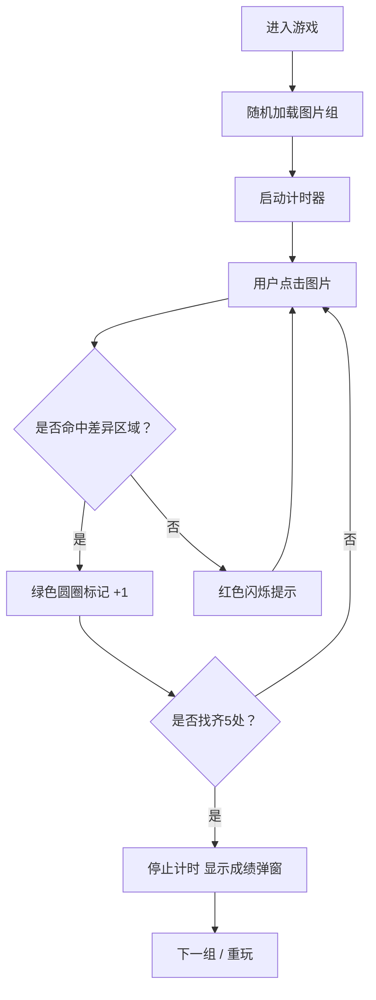

## 1. 产品概述

找茬图片对比游戏 - 一款经典的视觉差异寻找游戏。用户在左右并排的两张相似图片中找出 5 处细微差异，锻炼观察力和专注力。支持多组预设图片随机切换，记录完成用时。

- 目标用户：所有年龄段的休闲游戏爱好者
- 产品价值：轻松娱乐、锻炼视觉敏感度、消磨碎片时间

## 2. 核心功能

### 2.1 功能模块

1. **游戏主页**：标题区、游戏主区域（双图并排）、状态信息栏、控制按钮区
2. **差异标记系统**：点击检测、正确圈绿、错误闪红提示
3. **计时器**：实时显示游戏用时，完成后展示最终成绩
4. **图片组管理**：多组预设图片、随机顺序、切换功能

### 2.2 页面详情

| 页面名称 | 模块名称 | 功能描述 |
|-----------|-------------|---------------------|
| 游戏主页 | 标题与说明 | 游戏名称、玩法简介 |
| 游戏主页 | 双图展示区 | 左右并排展示两张对比图片，支持点击交互 |
| 游戏主页 | 进度状态栏 | 已找到差异数 / 总数、当前用时 |
| 游戏主页 | 差异标记层 | 正确位置绿色圆圈标记，错误点击红色闪烁 |
| 游戏主页 | 控制按钮 | 切换图片组、重新开始本局、显示提示 |
| 游戏主页 | 完成弹窗 | 展示用时、完成动画、继续下一组按钮 |

## 3. 核心流程

用户进入游戏 → 随机加载一组图片 → 计时器开始 → 用户点击疑似差异区域 → 系统判定 → 正确则绿色圈标记 +1 → 错误则红色闪烁提示 → 找齐 5 处差异 → 停止计时 → 显示成绩 → 可切换下一组或重玩

## 4. 用户界面设计

### 4.1 设计风格

- **主色调**：深靛蓝渐变背景 (#0f172a → #1e293b)，营造沉浸感
- **强调色**：翡翠绿 (#10b981) 标记正确，朱砂红 (#ef4444) 标记错误，琥珀金 (#f59e0b) 用于高亮
- **按钮风格**：圆角胶囊按钮，带悬浮发光效果
- **字体**：标题用 Playfair Display（优雅衬线），正文用 JetBrains Mono（等宽清晰）
- **布局风格**：卡片式悬浮布局，带毛玻璃效果和柔和阴影
- **动效**：圆圈脉冲动画、错误快速闪烁、数字滚动计时器

### 4.2 页面设计概述

| 页面名称 | 模块名称 | UI 元素 |
|-----------|-------------|-------------|
| 游戏主页 | 标题区 | 游戏名渐变文字 + 副标题 |
| 游戏主页 | 图片对容器 | 两张图片并排，分割线，各自可点击 |
| 游戏主页 | 状态条 | 进度徽章 + 计时器 + 提示按钮 |
| 游戏主页 | 控制区 | 刷新/切换按钮，重玩按钮 |
| 游戏主页 | 完成弹窗 | 居中毛玻璃卡片，用时展示，按钮 |

### 4.3 响应式

- 桌面优先：大尺寸双图并排（各占 45% 宽度）
- 平板适配：图片缩小，保持并排
- 移动端：上下堆叠布局，触控优化，点击区域放大
